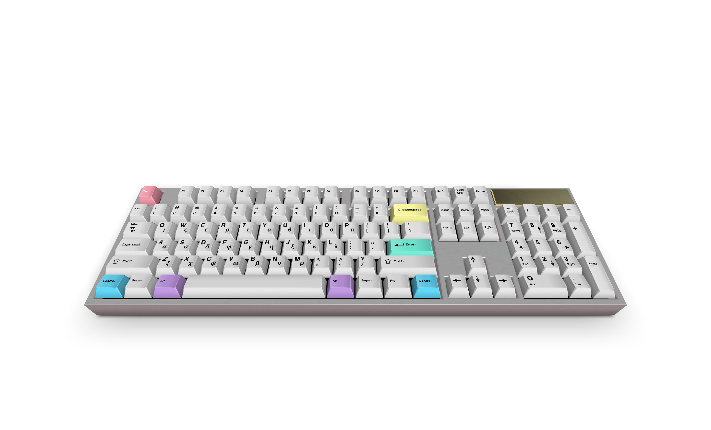

__*Missing bridge for synccing keyboard events across applications*__

---
## Introduction 
Milkeyways, is cross-platform, meta solution, for controlling and unifying input handling, across applications.

## How it works
<kbd>MKW</kbd>
is built on the idea that everything is context. 
It requires to first creae the root context.

```
mkw init root
```

*Root context, must implement hook function, it's not very important if, it's surpresses or not. Reason for hooking the global keyboard listener is not fetching the event, but extremelly optimizing, conditional evaluation of context.*

The data structure is Directed Acyclic Graph implements following:

1. Every context has the `active` property.
2. Every context is a separate node in the tree
3. For any context $X$  
(context")

 1. Given any context $X(*)$, there exists a path $P$  any context, here exist 
 1. At the top of the tree, there is always a root node with name "root" and _id=0 
```
context is by itself nothing more then just set 
```
```
(context, binder)
```
of contexts
First we have to register root listener
```
mkw init implement
```

Milkeyways is built on the tree structure:


```
(key_mapping, )
```

# Features


 to  provide solution, for unified exchange 


## Features


- Add conditional handlers
- 
```

```


# Local Server
```

```


## Browser extension
- Record macros
- Propose keypresses based on the history
- Assign hjkl
- Record history
